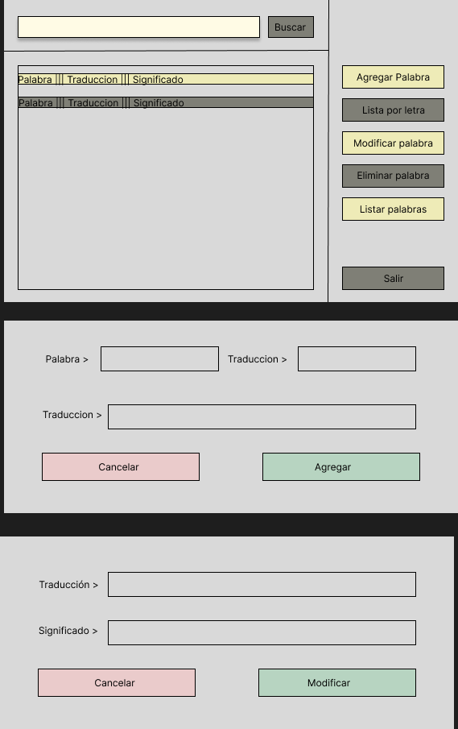

# Word-Dictionary
### This is an example of using a binary tree implemented in a word management application.
### We utilize Java Swing to represent it.
### [View documentation](https://joseslk.github.io/Word-Dictionary/doc/)

### 